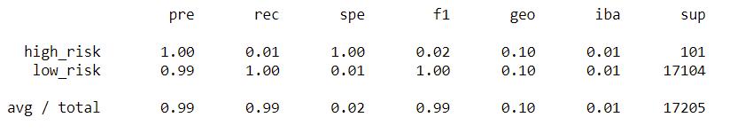
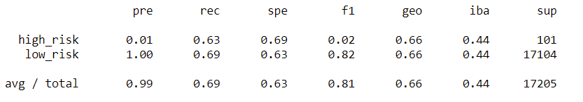
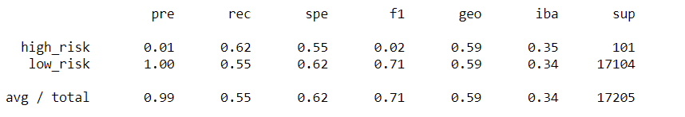
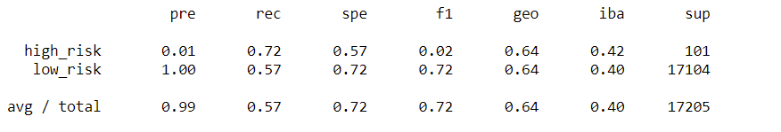
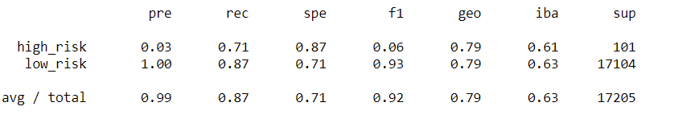
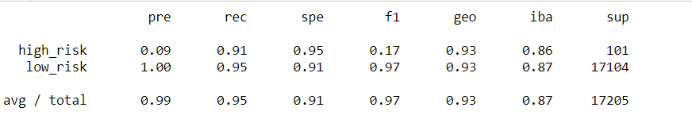
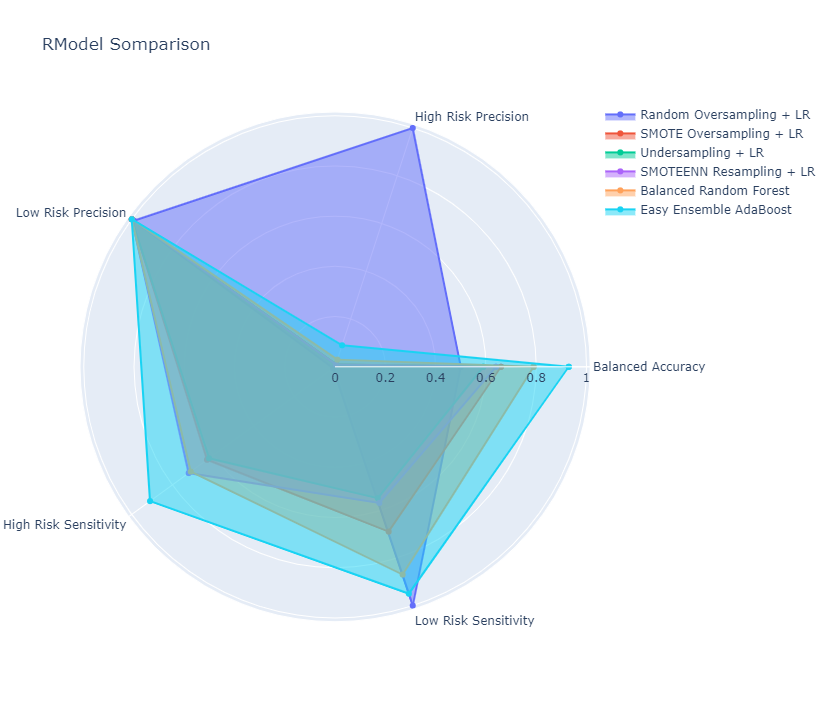

# Overview of the Loan Prediction Risk Analysis

Fast Lending, a peer-to-peer lending services company, wants to use machine learning to predict credit risk to provide a quicker and more reliable loan experience. In this assignment, I am building and evaluating several machine learning models to predict credit risk. Once these algorithms have been implemented, they will be compared to determine which presents the most accurate predictions based on model sensitivity and precision. 

Because credit risk is an inherently unbalanced classification problem, I will utilize various techniques such as resampling to train and evaluate the models. To do so, I will be using the imbalanced-learn and scikit-learn libraries.

Below, in the results section, the six models used will be compared on their balanced accuracy score, precision and recall scores.

# Results

## Logistic Regression
Four forms of resampling were performed on the data set before implementing a Logistic Regression Model. The evaluations of these models are as follows: 

### Naive Random Oversampling 
-  A balanced accuracy score of 0.50
-  Very high precision (1.00) in predicting high-risk applicants and very high precision in predicting low-risk applicants (0.99) 
- Very low sensitivity to high-risk applicants (0.01) but high sensitivity to low-risk applicants (1.00)

### SMOTE Oversampling
- A balanced accuracy score of 0.66
- Very low precision in predicting high-risk applicants (0.01) but very high precision in predicting low-risk applicants (1.00)
-  Moderate sensitivity to high-risk applicants (0.63) and low-risk applicants (0.69)

### Undersampling
- A balanced accuracy score of 0.59
- Very low precision in predicting high-risk applicants (0.01) but very high precision in predicting low-risk applicants (1.00)
- Moderate sensitivity to high-risk applicants (0.62) and low-risk applicants (0.55)

### SMOTEENN Resampling
- A balanced accuracy score of 0.64
- Very low precision in predicting high-risk applicants (0.01) but very high precision in predicting low-risk applicants (1.00)
- High sensitivity to high-risk applicants (0.72) and moderate sensitivity low-risk applicants (0.57)

In addition to Logistic Regression, two other models were used to predict credit risk. The evaluations of these models are as follows: 

## Balanced Random Forest Classifier
- A balanced accuracy score of 0.79
- Very low precision in predicting high-risk applicants (0.03) and very high precision in predicting low-risk applicants (1.00)
- Moderately high sensitivity to high-risk applicants (0.71) and moderately high sensitivity low-risk applicants (0.87)

## Easy Ensemble AdaBoost Classifier
- A balanced accuracy score of 0.93
- Low precision in predicting high-risk applicants (0.09) and very high precision for predicting low-risk applicants (1.00)
- Very high sensitivity to high-risk applicants (0.91) and low-risk applicants (0.95)

# Summary
When comparing the models base on balanced accuracy alone, the Easy Ensemble AdaBoost Classifier provides the best predictions of applicant risk with a score of 0.93. In this context, however, certain parameters have a greater weight when determining if one is superior for helping lenders assess the risk of loan applicants. While the impact of missing out on a low-risk applicant is not ideal, it is much more important for a model to correctly identify high-risk applicants as the effect of erroneously lending to one bears much more significant consequences. 

The most important parameter for measuring one of these model's performance is the sensitivity to high-risk applicants. Luckily for us, the model with the highest sensitivity to high-risk applicants was also the best performer overall. The Easy Ensemble AdaBoost Classifier correctly identified 91% of high-risk applicants. Its high sensitivity to low-risk applicants and high precision when predicting low-risk applicants lent themselves to a balanced accuracy score of 0.93. The one shortcoming of this model, which is shared with four of the other six models, is that it has a low (albeit not as low as most) precision when predicting high-risk applicants. This means that a fair number of low-risk applicants were incorrectly labelled as high risk; however, further training with larger and/or more detailed data sets may improve this score as well. 

In summary, while there were similar results produced by five of the six models, the Ensemble AdaBoost Classifier Model outperformed the rest both overall and on the most critical measure. As such, I recommend using this model while accumulating more data to train the model further and improve our predictions. 

